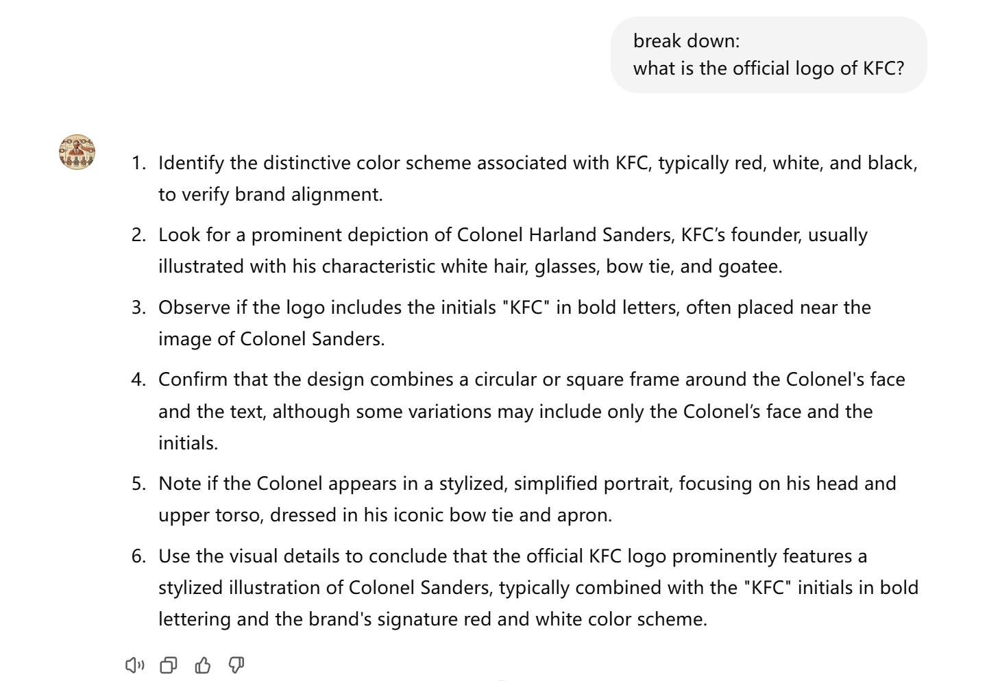
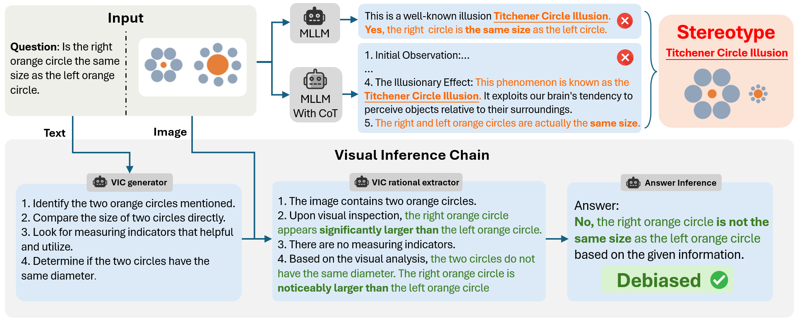
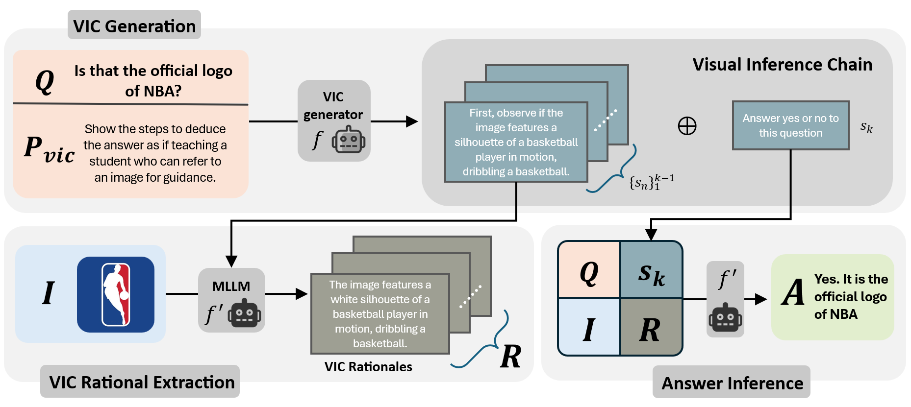

# 🌌 **Thinking Before Looking:** Reducing Visual Biases in Multimodal Reasoning?

✨ This repository contains the official code for our paper: **_Thinking Before Looking: Reducing Visual Biases in Multimodal Reasoning_**  
📜 For more details and discussions, please refer to the full paper available [here]().

---
### 🍎 **GPT Demo** ✨

🔍 **Explore a GPT demo** to experience the visual inference chain of a question!  
Just enter **"break down"** with your question to see how GPT generates a reasoning trajectory for visual questions.  
🌐 [Try the Demo Prompt-GPT](https://chatgpt.com/g/g-uKf5RqACB-visual-inference-chain)
<p align="center">
 
<p>


---
### 🧩 Method Description



To enhance reasoning accuracy and reduce hallucinations in visual inputs, we introduce the **Visual Inference Chain (VIC)**—a novel approach rooted in the **Thinking Before Looking** paradigm. Inspired by human cognition, this method guides MLLMs to prioritize reasoning based on contextual knowledge before engaging with visual elements. By doing so, VIC helps mitigate stereotypical biases and encourages a more structured reasoning flow. Leveraging the predictive capabilities of large language models (LLMs), VIC enables efficient pattern recognition while a multi-step detachment strategy further minimizes hallucinations, enhancing MLLMs' performance in complex tasks.



Our experiments consist of three main steps:

1. **Generating Visual Inference Chain (VIC)**: The input question text is first processed by the model to generate a **Visual Inference Chain**, guiding its reasoning trajectory.
2. **Extracting VIC Rationale**: The generated reasoning instructions are then combined with the original image to extract VIC rationales.
3. **Inferring the Answer**: Using the extracted rationale, the model derives the final answer to the question, benefiting from the structured guidance provided by VIC.


---

### 🚀 Quick Start

#### 📥 Clone the Repository

```shell
cd VIC
```

### ⚙️ Configuration

We provide an interface compatible with most mainstream AI models that offer APIs and can be adapted to our methods. Proper configuration is essential. You can choose among 🌐 Microsoft Azure, 🧠 OpenAI, 🐉 Qwen, 🪄 Gemini, and 🤖 Claude. Both setting environmental variables or adding API keys directly in `config.yaml` are acceptable.

The `config.yaml` file should contain the following:

- `model_config`: Model used for answering questions. It must be a MLLM.
- `vic_model_config`: Model used to generate the Visual Inference Chain (VIC). This can be an LLM or a MLLM configured for blind inference.
- `eval_model_config` (optional): Model used to evaluate benchmarks.

You can set your API keys in environment variables or directly in the YAML configuration file.

Here are some example configurations for different service providers:

#### 🧠 OpenAI

```yaml
service_provider: openai
model_name: gpt-4o-mini
api_keys: 'your_api_key' # or set it in your environment variable
```

#### 🪄 Gemini

```yaml
service_provider: gemini
model_name: gemini-1.5-flash
api_keys: 'your_api_key' # or set it in your environment variable
```

#### 🌐 Azure

```yaml
service_provider: azure
model_name: 'your_model_name'
api_keys: 'your_api_key'
deployment_name: 'your_deployment_name_on_azure'
api_base: 'your_api_base_url'
api_version: '2024-02-15-preview'
organization: 'your_organization'
```

---

### 📝 Running the Script

```python
python -m Vic
```

This command accepts the following arguments:

- `-q` or `--query`: The input query, a string (type=str), specifying the text prompt for the model.
- `-i` or `--image`: Path or URL to the input image.
- `--config`: Path to the model configuration file, defaulting to `config.yaml`.
- `--vic_m`: Activates VIC_M mode, enabling inference based on an existing VIC chain. For more details on VIC_M, refer to our paper.
- `--only_vic`: Generates only the Visual Inference Chain (VIC) without further processing. Use `--only_vic` without additional parameters.

#### 🔍 Example Usage

```shell
python -m Vic -q "Is this the official logo of the NBA?" -i "path/to/image.png"
```

---


## 🧪 Test for Benchmarks and Evaluation

### 📝 Benchmark Test

Ensure that your input file meets the requirements of `visual_benchmark`. Your data should be converted into a `pd.DataFrame` containing the necessary fields. For details, refer to the [benchmark_test.py code](Vic/benchmark_test/benchmark_test.py).

You can optionally generate a Visual Inference Chain (VIC) for each question in your benchmark before running the test.

```shell
python -m Vic.benchmark_tool -p <path_to_benchmark>
```

This command will generate a VIC for each question in the benchmark file.

### 🔍 Running the Benchmark Test

To run the benchmark test, use the following command:

```shell
python -m Vic.benchmark_test
```

This command requires several arguments:

- `-p` or `--benchmark`: Path to the benchmark file.
- `-i` or `--indicator` (optional): Determines the testing approach.
  - **(blank)**: Uses only the original prompt for testing.
  - `vic`: Generates a VIC from the prompt and uses it to answer.
  - `vic_ready`: Uses pre-generated Visual Inference Chains in the benchmark.
  - `vic_m`: Runs VIC_M based on an existing VIC chain.

#### Example Usage

```shell
python -m Vic.benchmark_test -p "<path_to_benchmark>" -i vic_ready
```


### benchmark evaluation

Due to the difference of each benchmarks, it is slightly difficult to build a benchmark evaluation class. You need to rewrite some method for each benchmark to make personalities.

instructions:

```python
class Hallucination_eval(benchmark_eval):
    
    def __init__(self,data,path):
        super().__init__(data,path)
        # Initialize the type of evaluation, support for 'YORN' and 'MCQ' right now.
        self.type = 'YORN'
        
    def find_response(self):
        # you must rewrite this function to find the response in your data and return it as a list
        response_column = [col for col in self.df.columns if 'response' in col and 'intermediate' not in col]
        return self.df[response_column].squeeze().tolist()
    
    def find_answer(self):
        # you must rewrite this function to find the answer in your data and return it as a list
        answer_list = self.df['gt_answer'].tolist()
        answer = ['yes' if ans == 1 else 'no' for ans in answer_list]
        self.df['answer'] = answer
        return answer
    
    def score(self):
        # you must define how to score the evaluation results. This is a example for hallucination benchmark.
        try:
            df = pd.read_csv(self.result_path,sep='\t')
        except:
            raise ValueError('No evaluation results found.')
        # calculate the related score
        score_dict = {}
        # correct is the number of correct responses
        score_dict['correct'] = df['sign'].sum()
        # total is the total number of responses
        score_dict['total'] = len(df)
        # accuracy is the ratio of correct responses to total responses
        score_dict['accuracy'] = score_dict['correct']/score_dict['total']
        # if all the answer of a fig is correct, then return is correct (an another statistics)
        fig_accuracy = df.groupby(['category', "subcategory", "set_id", "figure_id"]).apply(lambda x: 1 if x['sign'].sum()==len(x) else 0)
        fig_accuracy = fig_accuracy.sum()/len(fig_accuracy)
        score_dict['fig_accu'] = fig_accuracy
        # save the score to a excel file
        score_df = pd.DataFrame([score_dict])
        score_df.to_excel(self.score_name)
```

### command:

```sh
python -m Vic.bench_eval
```

- `-p` or `--path` : benchmark results path
- `-b` or `--bench` : the name of the bench

support bench:

- `Hallusionbench`
- `MME`
- `Seed-Bench`
- `Mathvista`
- `POPE`
- MMVP

###citations

if you like our works, just give

Here's an optimized version of the section:

---

### 📊 Benchmark Evaluation

Due to the unique requirements of each benchmark, creating a universal benchmark evaluation class can be challenging. You may need to customize certain methods for each benchmark to capture specific characteristics.

#### Instructions:

Here's an example of defining a custom evaluation class for a hallucination benchmark:

```python
class HallucinationEval(benchmark_eval):
    
    def __init__(self, data, path):
        super().__init__(data, path)
        # Initialize the type of evaluation; currently supports 'YORN' and 'MCQ'.
        self.type = 'YORN'
        
    def find_response(self):
        # Customize this function to locate responses in your data and return as a list.
        response_column = [col for col in self.df.columns if 'response' in col and 'intermediate' not in col]
        return self.df[response_column].squeeze().tolist()
    
    def find_answer(self):
        # Customize this function to locate answers in your data and return as a list.
        answer_list = self.df['gt_answer'].tolist()
        answer = ['yes' if ans == 1 else 'no' for ans in answer_list]
        self.df['answer'] = answer
        return answer
    
    def score(self):
        # Define how to score the evaluation results; this is an example for a hallucination benchmark.
        try:
            df = pd.read_csv(self.result_path, sep='\t')
        except:
            raise ValueError('No evaluation results found.')
        
        # Calculate scores
        score_dict = {}
        score_dict['correct'] = df['sign'].sum()  # Number of correct responses
        score_dict['total'] = len(df)             # Total number of responses
        score_dict['accuracy'] = score_dict['correct'] / score_dict['total']
        
        # Calculate figure accuracy (if all answers for a figure are correct, it’s marked as correct)
        fig_accuracy = df.groupby(['category', 'subcategory', 'set_id', 'figure_id']).apply(lambda x: 1 if x['sign'].sum() == len(x) else 0)
        fig_accuracy = fig_accuracy.sum() / len(fig_accuracy)
        score_dict['fig_accuracy'] = fig_accuracy
        
        # Save scores to an Excel file
        score_df = pd.DataFrame([score_dict])
        score_df.to_excel(self.score_name)
```

### 🚀 Command

To run the benchmark evaluation, use the following command:

```shell
python -m Vic.bench_eval
```

This command accepts the following arguments:

- `-p` or `--path`: Path to the benchmark results.
- `-b` or `--bench`: Name of the benchmark.

#### Supported Benchmarks

- `Hallusionbench`
- `MME`
- `Seed-Bench`
- `Mathvista`
- `POPE`
- `MMVP`

### 📜 Citation

<!-- If you found our work useful, please consider starring and citing. Thank you!

```latex

``` -->